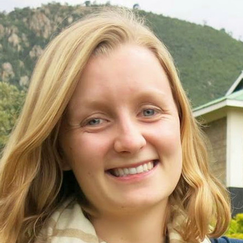
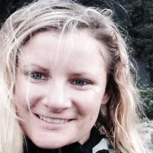

---
#
# By default, content added below the "---" mark will appear in the home page
# between the top bar and the list of recent posts.
# To change the home page layout, edit the _layouts/home.html file.
# See: https://jekyllrb.com/docs/themes/#overriding-theme-defaults
#
layout: home
---

> _With four parameters I can fit an elephant, and with five I can make it wiggle its trunk._ --- John Von Neumann (abridged)

### Differentiable vision, graphics, and physics applied to machine learning

“Differentiable programs” are parameterized programs that allow themselves to be rewritten by gradient-based optimization. They are ubiquitous in modern-day machine learning. Recently,  explicitly encoding our knowledge of the rules of the world in the form of differentiable programs has become more popular. In particular, differentiable realizations of well-studied processes such as physics, rendering, projective geometry, optimization to name a few, have enabled the design of several novel learning techniques. For example, many approaches have been proposed for unsupervised learning of depth estimation [1‒6] from unlabeled videos. Differentiable 3D reconstruction pipelines [7, 8] have demonstrated the potential for task-driven representation learning. A number of differentiable rendering approaches [9‒14] have been shown to enable single-view 3D reconstruction and other inverse graphics tasks (without requiring any form of 3D supervision). Differentiable physics simulators are being built [15‒20] to perform physical parameter estimation from video or for model-predictive control. While these advances have largely occurred in isolation, recent efforts [21‒24] have attempted to bridge the gap between the aforementioned areas. Narrowing the gaps between these otherwise isolated disciplines holds tremendous potential to yield new research directions and solve long-standing problems, particularly in understanding and reasoning about the 3D world.

Hence, we propose the “first workshop on differentiable computer vision, graphics, and physics in machine learning” with the aim of:
* Narrowing the gap and fostering synergies between the computer vision, graphics, physics, and machine learning communities
* Debating the promise and perils of differentiable methods, and identifying challenges that need to be overcome
* Raising awareness about these techniques to the larger ML community
* Discussing the broader impact of such techniques, and any ethical implications thereof.

Notably, most of the advances in our focus areas have occurred in the last 3-4 years, and the interest in this nascent field seems to be increasing (as evident from the push towards the release of open-source tools such as Kaolin [25], PyTorch3D [26], Kornia [27], tiny-differentiable-simulator [28], and more. This workshop aims to bring together researchers from outside the core ML community (such people from the graphics, vision, and physics simulation communities), enabling synergies among them.

## Confirmed speakers

We are excited to host invited talks from a series of fantastic speakers who are experts in differentiable vision, graphics, physics, and allied areas.

<table>
    <!-- Sanja Fidler -->
    <tr>
        <td>
            

                

                    
                

            

        </td>
        <td>
            

                <a href="http://www.cs.toronto.edu/~fidler/" target="_blank">Sanja Fidler</a>, <a href="http://www.utoronto.ca" target="_blank">University of Toronto</a>, <a href="https://nv-tlabs.github.io/"> NVIDIA</a>
            

        </td>
    </tr>
    <!-- Peter Battaglia -->
    <tr>
        <td>
            

                

                    
                

            

        </td>
        <td>
            

                <a href="https://scholar.google.com/citations?user=nQ7Ij30AAAAJ&hl=en" target="_blank">Peter Battaglia</a>, <a href="https://deepmind.com/" target="_blank">DeepMind</a>
            

        </td>
    </tr>
    <!-- Andrea Tagliasacchi -->
    <tr>
        <td>
            

                

                    
                

            

        </td>
        <td>
            

                <a href="http://gfx.uvic.ca/" target="_blank">Andrea Tagliasacchi</a>, <a href="https://ai.google/research/teams/brain/" target="_blank">Google Brain</a>
            

        </td>
    </tr>
    <!-- Georgia Gkioxari -->
    <tr>
        <td>
            

                

                    
                

            

        </td>
        <td>
            

                <a href="https://gkioxari.github.io/" target="_blank">Georgia Gkioxari</a>, <a href="https://research.facebook.com/ai/" target="_blank">Facebook AI Research</a>
            

        </td>
    </tr>
    <!-- Abhinav Gupta -->
    <tr>
        <td>
            

                

                    
                

            

        </td>
        <td>
            

                <a href="http://www.cs.cmu.edu/~abhinavg/" target="_blank">Abhinav Gupta</a>, <a href="https://www.cmu.edu/" target="_blank">Carnegie Mellon University</a>, <a href="https://research.facebook.com/ai/" target="_blank">Facebook AI Research</a>
            

        </td>
    </tr>
    <!-- Camillo Jose Taylor -->
    <tr>
        <td>
            

                

                    
                

            

        </td>
        <td>
            

                <a href="https://www.cis.upenn.edu/~cjtaylor/" target="_blank">Camillo Jose Taylor</a>, <a href="https://www.upenn.edu/" target="_blank">University of Pennsylvania</a>
            

        </td>
    </tr>
    <!-- Yuanming Hu -->
    <tr>
        <td>
            

                

                    
                

            

        </td>
        <td>
            

                <a href="http://taichi.graphics/me/" target="_blank">Yuanming Hu</a>, <a href="https://www.mit.edu/" target="_blank">Massachusetts Institute of Technology</a>
            

        </td>
    </tr>
</table>

### Call for papers

#### Areas of interest

The primary focus areas of this workshop are the following:
1. **Differentiable computer vision** techniques, including, but not limited to, differentiable depth and pose estimation, feature extraction and matching pipelines, image filtering, pointset alignment, reconstruction pipelines, and their applications.
2. **Differentiable geometry processing and graphics tools**, including, but not limited to, differentiable mesh manipulation, rendering, higher-order light transport, and their applications.
3. **Differentiable physics simulation** methods, that innovate either at the implementation level (i.e., differentiable reparameterizations of contact, articulated bodies, collisions, etc.) or the application level (policy learning, representation learning, physics-informed neural network design, etc.).
4. **Applications and limitations** of differentiable methods. Differentiable physics allows for more efficient model predictive control and system identification. Differentiable graphics and rendering might allow for more accurate novel viewpoint synthesis. However, there are also limitations: for example, gradients are not always useful in contact-rich or long-horizon manipulation tasks. Furthermore, differentiable methods are often applicable only where precise process models are available. How can differentiable methods be combined with gradient-free optimization (or other techniques) to circumvent these issues?
5. **Multi-disciplinary efforts** that integrate differentiable techniques from two or more of the above areas. This is a key area for the workshop. Examples include, but are not limited to, physics-aware visual representation learning, learning intuitive physics from videos, learning inverse graphics from images/videos.

A few representative publications in the interest areas of the workshop are listed in our references below.

#### Submission instructions

We invite **short papers** of upto **4 pages** (excluding references) in the areas listed above. Submissions will undergo a double-blind reviewing process and thus need to be appropriately anonymized. Additionally, submissions may use upload additional supplementary materials (appendices, code, videos, etc.). Looking at the supplementary materials is at the sole discretion of the reviewers. Submissions must follow the [Neurips template](https://neurips.cc/Conferences/2020/PaperInformation/StyleFiles). The workshop is **non-archival**: papers/abstracts accepted to the workshop will not appear in any formal proceedings. However, the papers, talks, and other materials (if any) will be posted on the workshop webpage to maximize visibility. Submissions that are currently under review or that have been recently accepted to a conference other than Neurips 2020 are permitted. All accepted papers will be presented in our virtual poster session and highlighted by a short, oral introduction (lightning talk). A select few promising, original contributions will be chosen for longer oral presentation.

For any queries or concerns about any aspect of the workshop, please do not hesitate to contact the organizers.

#### Early submission mentorship track

Our call for papers will include an early-submission mentorship track that pairs authors with experienced researchers who have committed to providing meaningful feedback to help polish papers for general submission. This program will facilitate a private dialogue between the mentee and mentor with the goal of fostering an inclusive and supportive research community.

Paper submissions to the mentorship track are to be true drafts with at least 80% of work completed. Mentors are expected to provide a timely initial review of the draft submission and are encouraged to continue to engage with the mentee as they prepare for their final submission.

Please complete [this form](https://docs.google.com/forms/d/1Ky6Et26ODf6IIgJwYcA22cWQVwUGUrjNBCR85eSrFiE/viewform?edit_requested=true) if you are interested in becoming a mentor for our 2020 NeurIPS workshop. If selected, we'll let you know your mentee matches by the week of September 24.

#### Important dates

* Early submission (mentorship track): **25 September 2020 (Friday), Noon (1200 hrs)** Eastern Daylight Time (EDT)
* Final workshop submissions due: **8 October 2020 (Thurday), Noon (1200 hrs)** Eastern Daylight Time (EDT)
* Author notifications: **23 October 2020 (Thursday), Noon (1200 hrs)** Eastern Daylight Time (EDT)

#### Submission portal

Our submission portal is now online: [https://cmt3.research.microsoft.com/DiffCVGP2020/](https://cmt3.research.microsoft.com/DiffCVGP2020/)

## Organizers

<table style="border-collapse: collapse; border: none;">
    <tr style="border: none;">
        <!-- Krishna -->
        <td style="border: none;">
        

            <a href="https://krrish94.github.io" target="_blank">
            

            
            

            </a>
            

                <a href="https://krrish94.github.io" target="_blank">Krishna Murthy Jatavallabhula</a> 
                <a href="https://mila.quebec/en/" target="_blank">Mila</a>, <a href="https://www.umontreal.ca/" target="_blank">UdeM</a>
            

        

        </td>
        <!-- Kelsey -->
        <td style="border: none;">
        

            <a href="https://web.mit.edu/krallen/www/" target="_blank">
              

              
              

            </a>
            

              <a href="https://web.mit.edu/krallen/www/" target="_blank">Kelsey Allen</a> 
              <a href="https://www.mit.edu/" target="_blank">Massachusetts Institute of Technology</a>
            

        

        </td>
        <!-- Victoria -->
        <td style="border: none;">
        

            <a href="https://vdean.github.io/" target="_blank">
              

              
              

            </a>
            

              <a href="https://vdean.github.io/" target="_blank">Victoria Dean</a> 
              <a href="https://www.cmu.edu/" target="_blank">Carnegie Mellon University</a>
            

        

        </td>
    </tr>
    <tr style="border: none;">
        <!-- Johanna -->
        <td style="border: none;">
        

            <a href="https://johannah.github.io/" target="_blank">
              

              
              

            </a>
            

              <a href="https://johannah.github.io/" target="_blank">Johanna Hansen</a> 
              <a href="https://mila.quebec/en/" target="_blank">Mila</a>, <a href="https://mcgill.ca/" target="_blank">McGill</a>
            

        

        </td>
        <!-- Shuran -->
        <td style="border: none;">
        

            <a href="https://shurans.github.io/" target="_blank">
              

              
              

            </a>
            

              <a href="https://shurans.github.io/" target="_blank">Shuran Song</a>, <a href="https://www.cs.columbia.edu/" target="_blank">Columbia University</a>
            

        

        </td>
        <!-- Florian -->
        <td style="border: none;">
        

            <a href="http://www.cs.toronto.edu/~florian/" target="_blank">
              

              
              

            </a>
            

              <a href="http://www.cs.toronto.edu/~florian/" target="_blank">Florian Shkurti</a> 
              <a href="https://vectorinstitute.ai/" target="_blank">Vector institute</a>, <a href="https://www.utoronto.ca/" target="_blank">University of Toronto</a>
            

        

        </td>
    </tr>
    <tr style="border: none;">
        <!-- Liam -->
        <td style="border: none;">
        

            <a href="https://liampaull.ca/" target="_blank">
              

              
              

            </a>
            

              <a href="https://liampaull.ca/" target="_blank">Liam Paull</a> 
              <a href="https://mila.quebec/en/" target="_blank">Mila</a>, <a href="https://www.umontreal.ca/" target="_blank">Universite de Montreal</a>
            

        

        </td>
        <!-- Derek -->
        <td style="border: none;">
        

            <a href="http://www.cim.mcgill.ca/~derek/" target="_blank">
              

              
              

            </a>
            

              <a href="http://www.cim.mcgill.ca/~derek/" target="_blank">Derek Nowrouzezahrai</a> 
              <a href="https://mila.quebec/en/" target="_blank">Mila</a>, <a href="https://mcgill.ca/" target="_blank">McGill</a>
            

        

        </td>
        <!-- Josh -->
        <td style="border: none;">
        

            <a href="http://web.mit.edu/cocosci/josh.html" target="_blank">
                

                
                

            </a>
            

              <a href="http://web.mit.edu/cocosci/josh.html" target="_blank">Josh Tenenbaum</a> 
              <a href="https://www.mit.edu/" target="_blank">Massachusetts Institute of Technology</a>
            

        

        </td>
    </tr>
</table>

### Program chairs

<table style="border-collapse: collapse; border: none;">
    <tr style="border: none;">
        <!-- Krishna -->
        <td style="border: none;">
        

            <a href="https://krrish94.github.io" target="_blank">
            

            
            

            </a>
            

                <a href="https://krrish94.github.io" target="_blank">Krishna Murthy Jatavallabhula</a> 
                <a href="https://mila.quebec/en/" target="_blank">Mila</a>, <a href="https://www.umontreal.ca/" target="_blank">UdeM</a>
            

        

        </td>
        <!-- Kelsey -->
        <td style="border: none;">
        

            <a href="https://web.mit.edu/krallen/www/" target="_blank">
              

              
              

            </a>
            

              <a href="https://web.mit.edu/krallen/www/" target="_blank">Kelsey Allen</a> 
              <a href="https://www.mit.edu/" target="_blank">Massachusetts Institute of Technology</a>
            

        

        </td>
    </tr>
</table>

### Diversity, equity, and inclusion chair

<table style="border-collapse: collapse; border: none;">
    <tr style="border: none;">
        <td style="border: none;">
        

            <a href="https://vdean.github.io/" target="_blank">
              

              
              

            </a>
            

              <a href="https://vdean.github.io/" target="_blank">Victoria Dean</a> 
              <a href="https://www.cmu.edu/" target="_blank">Carnegie Mellon University</a>
            

        

        </td>
    </tr>
</table>

### Mentorship and outreach chair

<table style="border-collapse: collapse; border: none;">
    <tr style="border: none;">
        <!-- Johanna -->
        <td style="border: none;">
        

            <a href="https://johannah.github.io/" target="_blank">
              

              
              

            </a>
            

              <a href="https://johannah.github.io/" target="_blank">Johanna Hansen</a> 
              <a href="https://mila.quebec/en/" target="_blank">Mila</a>, <a href="https://mcgill.ca/" target="_blank">McGill</a>
            

        

        </td>
    </tr>
</table>

### Advisory board

<table style="border-collapse: collapse; border: none;">
    <tr style="border: none;">
        <!-- Shuran -->
        <td style="border: none;">
        

            <a href="https://shurans.github.io/" target="_blank">
              

              
              

            </a>
            

              <a href="https://shurans.github.io/" target="_blank">Shuran Song</a>, <a href="https://www.cs.columbia.edu/" target="_blank">Columbia University</a>
            

        

        </td>
        <!-- Florian -->
        <td style="border: none;">
        

            <a href="http://www.cs.toronto.edu/~florian/" target="_blank">
              

              
              

            </a>
            

              <a href="http://www.cs.toronto.edu/~florian/" target="_blank">Florian Shkurti</a> 
              <a href="https://vectorinstitute.ai/" target="_blank">Vector institute</a>, <a href="https://www.utoronto.ca/" target="_blank">University of Toronto</a>
            

        

        </td>
        <!-- Liam -->
        <td style="border: none;">
        

            <a href="https://liampaull.ca/" target="_blank">
              

              
              

            </a>
            

              <a href="https://liampaull.ca/" target="_blank">Liam Paull</a> 
              <a href="https://mila.quebec/en/" target="_blank">Mila</a>, <a href="https://www.umontreal.ca/" target="_blank">Universite de Montreal</a>
            

        

        </td>
    </tr>
</table>
<table style="border-collapse: collapse; border: none;">
    <tr style="border: none;">
        <!-- Derek -->
        <td style="border: none;">
        

            <a href="http://www.cim.mcgill.ca/~derek/" target="_blank">
              

              
              

            </a>
            

              <a href="http://www.cim.mcgill.ca/~derek/" target="_blank">Derek Nowrouzezahrai</a> 
              <a href="https://mila.quebec/en/" target="_blank">Mila</a>, <a href="https://mcgill.ca/" target="_blank">McGill</a>
            

        

        </td>
        <!-- Josh -->
        <td style="border: none;">
        

            <a href="http://web.mit.edu/cocosci/josh.html" target="_blank">
                

                
                

            </a>
            

              <a href="http://web.mit.edu/cocosci/josh.html" target="_blank">Josh Tenenbaum</a> 
              <a href="https://www.mit.edu/" target="_blank">Massachusetts Institute of Technology</a>
            

        

        </td>
    </tr>
</table>

### References

1. Garg R., B.G. V.K., Carneiro G., Reid I. Unsupervised CNN for Single View Depth Estimation: Geometry to the Rescue. ECCV 2016.
2. Zhou T., Brown M., Snavely N., Lowe D. Unsupervised Learning of Depth and Ego-Motion from Video. CVPR 2017.
3. Godard C., Aodha O., Brostow G. Unsupervised Monocular Depth Estimation with Left-Right Consistency. CVPR 2017.
4. Godard C., Aodha O., Firman M., Brostow, G. Digging into Self-Supervised Monocular Depth Prediction. ICCV 2019.
5. Guizilini V., Ambrus R., Pillai S., Raventos A., Gaidon A. PackNet-SfM: 3D Packing for Self-Supervised Monocular Depth Estimation. CVPR 2020.
6. Luo X., Huang, J., Szeliski R., Matzen K., Kopf J. Consistent Video Depth Estimation. SIGGRAPH 2020.
7. Zhou H., Ummenhofer B., Brox T. DeepTAM: Deep Tracking and Mapping. ECCV 2018.
8. Jatavallabhula K., Iyer G., Paull L. gradSLAM: Dense SLAM meets automatic differentiation.  ICRA 2020.
9. Loper M., Black M. OpenDR: An Approximate Differentiable Renderer. ECCV 2014.
10. Kato H., Ushiku Y., Tatsuya H. Neural 3D Mesh Renderer. CVPR 2018.
11. Liu S., Li T., Chen W., Li H. Soft Rasterizer: A Differentiable Renderer for Image-based 3D Reasoning. ICCV 2019.
12. Chen W., Gao J., Ling H., Smith E., Lehtinen J., Jacobson A., Fidler S. Learning to Predict 3D Objects with an Interpolation-based Differentiable Renderer. Neurips 2019.
13. Li T., Aittala M., Fredo D., Lehtinen J. Differentiable Monte Carlo Ray Tracing through Edge Sampling. SIGGRAPH Asia 2018.
14. Nimier-David M., Vicini D., Zeltner T., Jakob W. Mitsuba 2: A Retargetable Forward and Inverse Renderer. SIGGRAPH Asia 2019.
15. Toussaint M., Allen K., Smith K., Tenenbaum J. Differentiable Physics and Stable Modes for Tool-Use and Manipulation Planning. RSS 2018.
16. Belbute-Peres F., Smith K., Allen K., Tenenbaum J., Kolter Z. End-to-End Differentiable Physics for Learning and Control. Neurips 2018.
17. Degrave J., Hermans M., Dambre J., Wyffels F. A Differentiable Physics Engine for Deep Learning in Robotics. Frontiers in Neurorobotics 2019.
18. Hu Y., Liu J., Spielberg A., Tenenbaum J., Freeman W., Wu J., Rus D., and Matusik W. Chainqueen: A real-time differentiable physical simulator for soft robotics. ICRA 2019.
19. Liang J., Lin M., and Koltun V.  Differentiable cloth simulation for inverse problems. Neurips 2019.
20. Hu Y., Anderson L., Li T., Sun Q., Carr N., Ragan-Kelley J., Durand F.. Difftaichi: Differentiable programming for physical simulation. ICLR 2020.
21. Wu J., Lu E., Kohli P., Freeman W., Tenenbaum J.. Learning to see physics via visual de-animation. Neurips 2017.
22. Guen V., Thome N. Disentangling Physical Dynamics from Unknown Factors for Unsupervised Video Prediction. CVPR 2020.
23. Jatavallabhula K., Macklin M., Golemo F., Voleti V., Petrini L., Wiess M., Considine B., Parent-Levesque J., Xie K., Erleben K., Paull L., Shkurti F., Fidler S., Nowrouzezahrai D. gradSim: Differentiable physics and rendering engines for parameter estimation from video.
24. Jaques M., Burke M., Hospedales T. Physics-as-inverse-graphics:Joint unsupervised learning of objects and physics from video. ICLR 2020.
25. Jatavallabhula K., Smith E., Lafleche J., Tsang C., Rozantsev A., Chen W., Xiang T., Lebaredian R., Fidler S. Kaolin: A PyTorch Library for Accelerating 3D Deep Learning Research. arXiv 2019.
26. Ravi N., Reizenstein J., Novotny D., Gordon T., Lo W., Johnson J., Gkioxari G. Pytorch3D (https://github.com/facebookresearch/pytorch3d).  2020 (accessed June 15 2020)
27. Riba E., Mishkin D., Ponsa D., Rublee E., Bradski G. Kornia: an Open Source Differentiable Computer Vision Library for PyTorch. WACV 2020.
28. Google Research. Tiny Differentiable Simulator (https://github.com/google-research/tiny-differentiable-simulator). 2020 (accessed June 15, 2020).

<!-- [Miles Macklin](http://blog.mmacklin.com/): [University of Copenhagen](https://www.ku.dk/english/), [NVIDIA](https://www.nvidia.com/en-us/) -->

<!-- Old format

  
  

    
    

      <a href="https://krrish94.github.io" target="_blank">Krishna Murthy Jatavallabhula</a> 
      <a href="https://mila.quebec/en/" target="_blank">Mila</a>, <a href="https://www.umontreal.ca/" target="_blank">Universite de Montreal</a>
    

  

  
  

    
    

      <a href="https://web.mit.edu/krallen/www/" target="_blank">Kelsey Allen</a> 
      <a href="https://www.mit.edu/" target="_blank">Massachusetts Institute of Technology</a>
    

  

  
  

    
    

      <a href="https://vdean.github.io/" target="_blank">Victoria Dean</a> 
      <a href="https://www.cmu.edu/" target="_blank">Carnegie Mellon University</a>
    

  

  

    
    

      <a href="https://johannah.github.io/" target="_blank">Johanna Hansen</a> 
      <a href="https://mila.quebec/en/" target="_blank">Mila</a>, <a href="https://mcgill.ca/" target="_blank">McGill</a>
    

  

  

    
    

      <a href="https://shurans.github.io/" target="_blank">Shuran Song</a>, <a href="https://www.cs.columbia.edu/" target="_blank">Columbia University</a>
    

  

  

    
    

      <a href="http://www.cs.toronto.edu/~florian/" target="_blank">Florian Shkurti</a> 
      <a href="https://vectorinstitute.ai/" target="_blank">Vector institute</a>, <a href="https://www.utoronto.ca/" target="_blank">University of Toronto</a>
    

  

  

    
    

      <a href="https://liampaull.ca/" target="_blank">Liam Paull</a> 
      <a href="https://mila.quebec/en/" target="_blank">Mila</a>, <a href="https://www.umontreal.ca/" target="_blank">Universite de Montreal</a>
    

  

  

    
    

      <a href="http://www.cim.mcgill.ca/~derek/" target="_blank">Derek Nowrouzezahrai</a> 
      <a href="https://mila.quebec/en/" target="_blank">Mila</a>, <a href="https://mcgill.ca/" target="_blank">McGill</a>
    

  

  

    
    

      <a href="http://web.mit.edu/cocosci/josh.html" target="_blank">Josh Tenenbaum</a> 
      <a href="https://www.mit.edu/" target="_blank">Massachusetts Institute of Technology</a>
    

  

-->
